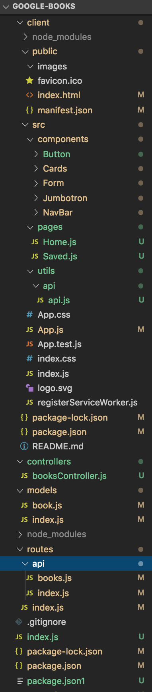

# Google Books Search and Find

### `Demo Link`
https://chilling-pumpkin-42059.herokuapp.com/

## `Summary`
'Google Books Search and Find' is an application, built upon React, is a search engine to search for books with Google Books' API. 'Google Books Search and Find' uses **react-router-dom** to navigate, hide and outputting the components without changing the routes within Express through the webpage. By displaying the books stored from Google Books' API database. The front-end React application will dynamically create its updated search results of books-- and the backend Express application will run independently. With the use of helper/utility functions, are we able to display and query the books 

### `File Structure`


## `Getting Started`
The simpliest way in seeing a demo of 'Google Books Search and Find' is to click on the Heroku demo link right above that leads it directly to the project without any installations required. This link can be found within this readme file or at the description area within https://github.com/duongsters/Google-Books

To connect locally...
1) Clone Google Books Search and Find's repository via https://github.com/duongsters/Google-Books
2) Run command line Terminal (or via Gitbash) 'npm install' for required NPMs used within the application ('npm i express axios mongoose react react-router-dom ')...or just download all NPMs from Technologies Used below.
3) Run command line 'npm start' to start up the application
4) Once connected to http://localhost:3000/ from CLI, copy that exact link to URL
5) Run 'ctrl + c' within the CLI to exit 'Google Books Search and Find' entirely


## `Technologies Used`
- React
- node
- Mongoose
- HTML
- CSS
- Javascript
- Heroku
- Bootstrap
- NPM: Axios, Mongoose, React-Router-Dom

## `Learning Experience`


## `Code Snippets`
via api.js:
* This code snippet shows the various function calls to (order of each functions below): retrieve books from the API database through 'getGoogleSearchBooks', get all books from the search through 'getBooks', get a specfic user chosen book through 'getBook', save/favorite a book through 'saveBook', and delete a book from the user's saved books list through 'deleteBook'
```javascript
    getGoogleSearchBooks: function (query) {
        return axios.get("https://www.googleapis.com/books/v1/volumes?q=" + query)
    },
    getBooks: function () {
        return axios.get("/api/books/");
    },
    getBook: function (id) {
        return axios.get("/api/books/" + id);
    },
    saveBook: function (savedBooks) {
        return axios.post("/api/books/", savedBooks);
    },
    deleteBook: function (id) {
        return axios.delete("/api/books/" + id);
    }
```
via gameboard.js:
* The code snippet below shows
```javascript

```


## Author Links:
- [GitHub](https://github.com/duongsters) ||
 [LinkIn](https://www.linkedin.com/in/theandrewduong/) ||
 [Portfolio](https://www.duongsters.github.io/updated-portfolio/)
